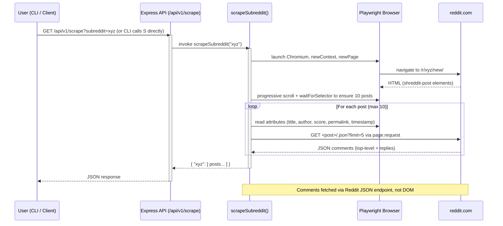

## SubSpy — Reddit Latest Posts Scraper (Node.js + Playwright)

SubSpy is a Node.js + Playwright scraper that, given a subreddit name, fetches the latest 10 posts and the first 5 top‑level comments (with nested replies) and outputs a single JSON file shaped as:

```json
{
  "<subreddit>": [ { /* post */ }, { /* post */ } ]
}
```

It also exposes a small HTTP API that runs the same scraping logic and returns the JSON response directly.


### Features
- Fetches up to 10 most recent posts from a subreddit’s New feed
- Extracts per‑post metadata: `title`, `author`, `upvotes` (number|null), `url`, `posted_at`
- Fetches up to 5 top‑level comments per post via Reddit’s JSON endpoint; replies are recursively included
- Politeness delays and resilient Playwright waits (no brittle sleeps)
- CLI output to `reddit_results.json` and HTTP API response


### Requirements
- Node.js 18+
- Playwright dependencies


### Install
```bash
npm install
npx playwright install
```


### CLI Usage
Run the scraper and write results to `reddit_results.json` at the project root.

```bash
# Example: scrape the javascript subreddit
npm run scrape -- javascript
```

Output shape example (truncated):

```json
{
  "javascript": [
    {
      "title": "Interesting JS trick",
      "author": "user123",
      "upvotes": 1234,
      "url": "https://www.reddit.com/r/javascript/comments/abc123/interesting_js_trick/",
      "posted_at": "2025-10-05T14:12:03.123Z",
      "comments": [
        {
          "author": "commenterA",
          "comment": "Nice!",
          "replies": [ { "author": "replyUser", "comment": "Agreed", "replies": [] } ]
        }
      ]
    }
  ]
}
```


### HTTP API
Start the server:

```bash
npm run dev
```

Endpoint (current path):
- `GET http://localhost:1010/api/v1/scrape?subreddit=<name>`

Notes:
- Returns `400` if `subreddit` is missing
- Returns `500` for internal errors


### Mermaid Diagram — High‑Level Flow



### Design Choices
- **Selectors**: Uses `shreddit-post` elements and reads resilient attributes (e.g., `post-title`, `author`, `score`, `permalink`, `created-timestamp`). Falls back to DOM text where needed.
- **Comments**: Pulled from Reddit’s `/.json?limit=5` endpoint to avoid fragile DOM parsing. Replies are parsed recursively.
- **Timing**: Uses `waitForSelector` and incremental scrolling to ensure post availability; small delays (500–700ms) for politeness.
- **Timestamps**: Normalized to ISO where possible using attribute `created-timestamp`; falls back to `faceplate-timeago` values.


### Limitations & Notes
- **Upvotes formatting**: Shorthand scores like `1.2k` may be returned as `null` if not numeric; can be enhanced to parse `k/m` suffixes.
- **Reply depth**: Replies are included recursively without a hard cap; extremely deep trees are rare but possible.
- **Non‑existent subreddits**: Returns an empty list for the subreddit key; check logs for context.
- **API path**: Assignment calls for `/scrape`; this project currently exposes `/api/v1/scrape`. Adjust routing or use the documented path.
- **Concurrency & timeouts**: Single process with polite delays; basic robustness is implemented, but request concurrency limits/timeouts can be added if needed.


### Project Scripts
Defined in `package.json`:

```json
{
  "scripts": {
    "dev": "nodemon index.ts",
    "scrape": "ts-node scrape.ts"
  }
}
```

Common commands:
- `npm run scrape -- <subreddit>`: Run the CLI scraper and write `reddit_results.json`
- `npm run dev`: Start the HTTP server on port `1010`


### Troubleshooting
- If Playwright complains about missing browsers, run `npx playwright install`.
- If navigation times out, ensure the subreddit exists and your network/firewall allows reddit.com.


